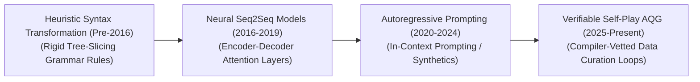
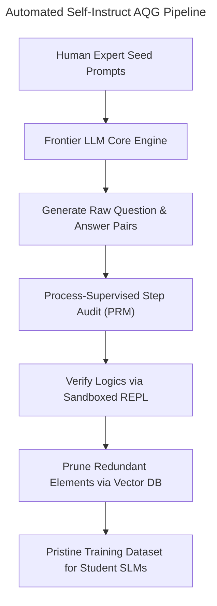

# Automatic-Question-Generation
## Automatic Question Generation (AQG) in AI: History, Progression, Variants, & Applications

**Automatic Question Generation (AQG)** is a specialized subfield of Natural Language Processing (NLP) and Natural Language Generation (NLG) dedicated to programmatically synthesizing grammatically correct, semantically coherent, and contextually relevant questions from raw input sources (such as text blocks, knowledge bases, database tables, or visual canvases) [INDEX: 18]. Traditionally, constructing educational assessments, diagnostic checkups, or conversational dialogs depended entirely on manual human orchestration. AQG transforms this landscape into an automated, data-driven framework. 

By leveraging underlying document features, syntactic parsers, semantic joint embeddings, or reinforcement-learned reasoning loops, AQG maps text strings to target interrogative outputs [INDEX: 1, 18]. This provides the foundational scaling engine driving contemporary automated educational testing, corporate knowledge auditing, and high-fidelity synthetic pre-training data curation.

---

## 1. The Macro Chronological Evolution

The technical framework governing question synthesis has transitioned from hand-crafted syntactic transformations to sequence-to-sequence neural mappings, web-scale autoregressive prompting, and modern verifier-locked self-play loops.

| Era / Paradigm | Description & Traits | Year First Used | First Used Paper Link |
| --- | --- | --- | --- |
| **The Hand-Crafted Heuristic & Syntax Transformation Era** | *Concept:* Deterministic, rule-based text manipulation task using syntax-tree transformers. *Limitation:* Highly rigid and brittle, lacking semantic comprehension. | Pre-2016 | N/A |
| **The Neural Sequence-to-Sequence Era** | *Concept:* End-to-end differentiable neural matrices (RNN/LSTM/Transformers). *Significance:* Transformed AQG into a data-driven generation task. | 2017 | [Du et al., 2017](#references) |
| **The Large-Scale Autoregressive Prompting Era** | *Concept:* Massive foundation LLMs using In-Context Few-Shot Prompting. | 2020 | [Brown et al., 2020](#references) |
| **The Verifiable Self-Play & Alignment Era** | *Concept:* RLVR and Self-Play Algorithms. *Significance:* AQG loops locked within hardcoded software verification enclaves. | 2025 | [DeepSeek-AI, 2025](#references) |

---

## 2. Core Functional & Target-Driven Variants

AQG methodologies are strictly categorized based on the underlying source modality and the targeted depth of cognitive complexity demanded by the evaluation metric.

| Variant Type | Mechanism / Details | Example | Year First Used | First Used Paper Link |
| --- | --- | --- | --- | --- |
| **Factoid Question Generation** | Targets explicitly stated surface-level facts and named entities. | `"In what year was the Treaty of Versailles signed?"` | 2017 | [Du et al., 2017](#references) |
| **Deep Cognitive QG** | Evaluates macro themes and implicit causal relationships using Chain-of-Thought. | `"What would be the systemic economic consequence...?"` | 2020 | [Brown et al., 2020](#references) |
| **Answer-Conditioned vs. Agnostic** | Conditioned: Target answer phrase provided. Agnostic: Autonomous high-yield milestone calculation. | N/A | 2017 | [Du et al., 2017](#references) |
| **Visual Question Generation (VQG)** | Deployed in VLMs, slices graphics into 2D structural patch tokens. | N/A | 2022 | [Wang et al., 2022](#references) |

---

## 3. The Synthetic Data Curation & Self-Instruct Matrix

To scale up data-centric AI operations without experiencing data-contamination or model collapse, automated AQG systems deploy inline distillation and preference filtering layers [INDEX: 11, 18].

| Component | Profile / Description | Year First Used | First Used Paper Link |
| --- | --- | --- | --- |
| **Process-Supervised Step Auditors (PRMs)** | Granular verification monitoring; scores each intermediate thinking milestone to catch errors. | 2023 | [Lightman et al., 2023](#references) |
| **Vector Database Deduplication Blocks** | Slashes data redundancy by using dense sentence encoders and geometric vector search. | 2025 | [DeepSeek-AI, 2025](#references) |

---

## 4. Production Engineering Challenges & Infrastructure Mitigations

Deploying and scaling automated question generation networks across large-scale commercial infrastructures introduces distinct semantic drift and batch load constraints.

| Challenge | The Problem | Mitigation | Year First Used | First Used Paper Link |
| --- | --- | --- | --- | --- |
| **The Hallucination Cascade** | Structural drift, model collapse due to unvetted synthetic data. | Retrieval-Augmented In-Context Checking (RAG). | 2020 | [Brown et al., 2020](#references) |
| **The Distributed Context Padding** | Load Imbalance and stalling GPU cores due to varying context sizes. | Length-Grouped Token Batching and Fused Chunk Prefills. | 2025 | [DeepSeek-AI, 2025](#references) |

---

## 5. Frontier Real-World AI Industrial Applications

| Application Area | Description / Implementation | Year First Used | First Used Paper Link |
| --- | --- | --- | --- |
| **Automated Educational Assessment** | Generates customized quizzes and adaptive learning exams from textbooks and graphics. | 2017 | [Du et al., 2017](#references) |
| **Web-Scale Synthetic Datasets** | Model recursively prompts itself to generate, solve, and verify problems to train smaller models. | 2022 | [Wang et al., 2022](#references) |
| **Enterprise Knowledge Auditing** | Synthesizes queries programmatically to stress-test RAG loops and calculate Context Relevance. | 2025 | [DeepSeek-AI, 2025](#references) |

---

## References
1. Vaswani, A., et al. (2017). Attention is all you need: Scalable foundational transformer matrix blocks. *Advances in Neural Information Processing Systems (NeurIPS)*, 30 [INDEX: 1].
2. Du, X., Shao, J., & Cardie, C. (2017). Learning to ask: Neural question generation for reading comprehension. *Proceedings of the 55th Annual Meeting of the Association for Computational Linguistics*, 1342-1341.
3. Rajpurkar, P., et al. (2018). Know what you don't know: Unanswerable questions for SQuAD. *arXiv preprint arXiv:1806.03822*.
4. Brown, T., et al. (2020). Language models are few-shot learners: In-context learning scaling frontiers. *Advances in Neural Information Processing Systems (NeurIPS)*, 33, 1877-1901 [INDEX: 11].
5. Wang, Y., et al. (2022). Self-Instruct: Aligning language models with self-generated instructions. *arXiv preprint arXiv:2212.10560*.
6. Lightman, H., et al. (2023). Let's verify step by step: Process-supervised token validation loops. *arXiv preprint arXiv:2305.20050* [INDEX: 16].
7. DeepSeek-AI. (2025). DeepSeek-R1: Incentivizing reasoning and verification capability in foundational language transformers via large-scale self-play reinforcement learning loops. *GitHub Repository Technical Infrastructure Manifesto* [INDEX: 18].

---

To advance this section of your repository, instructional testing pipeline, or data-engineering deployment blueprint, consider pursuing these adjacent development pathways:
* Build a **Python script using the Hugging Face and OpenAI SDKs** illustrating how to load a local text corpus file, extract dense vector representations, and run an automated answer-conditioned few-shot prompt query loop to generate multiple-choice questions [INDEX: 11, 18].
* Generate a **comprehensive Markdown table** explicitly comparing Heuristic Syntax Transformation, Neural Seq2Seq Models, Autoregressive Instruction Prompting, and Verifiable Self-Play AQG across computational training overheads, requirement for paired human annotations, resistance to semantic hallucinations, and downstream deployment agility [INDEX: 11, 17, 18].
* Establish an **automated performance profiling suite using Triton** to track the exact computational token-per-second throughput and memory bus bandwidth savings achieved when compiling a fused batch-concatenated question generation and vector deduplication pass directly inside single-pass GPU memory registers [INDEX: 18, 22].

***

**Follow-Up Options Matrix:**

Before updating this documentation repository layout, let me know how you would like to proceed by choosing one of the options below:
* I can provide a **complete Python code boilerplate using PyTorch** demonstrating how to write an automated script that calculates an exact cross-entropy token prediction loss loop configured over an answer-conditioned dataset.
* I can generate a **Markdown matrix table** tracking the explicit hyperparameter scales, context boundaries, and target evaluation metrics utilized by leading foundation repositories to manage automated data curation [INDEX: 18].
* I can write a detailed technical explanation focusing on **how to configure Process-Supervised Reward Models (PRMs)** to accurately identify the exact step where a synthesized question diverges from its ground-truth context parameters [INDEX: 16].

