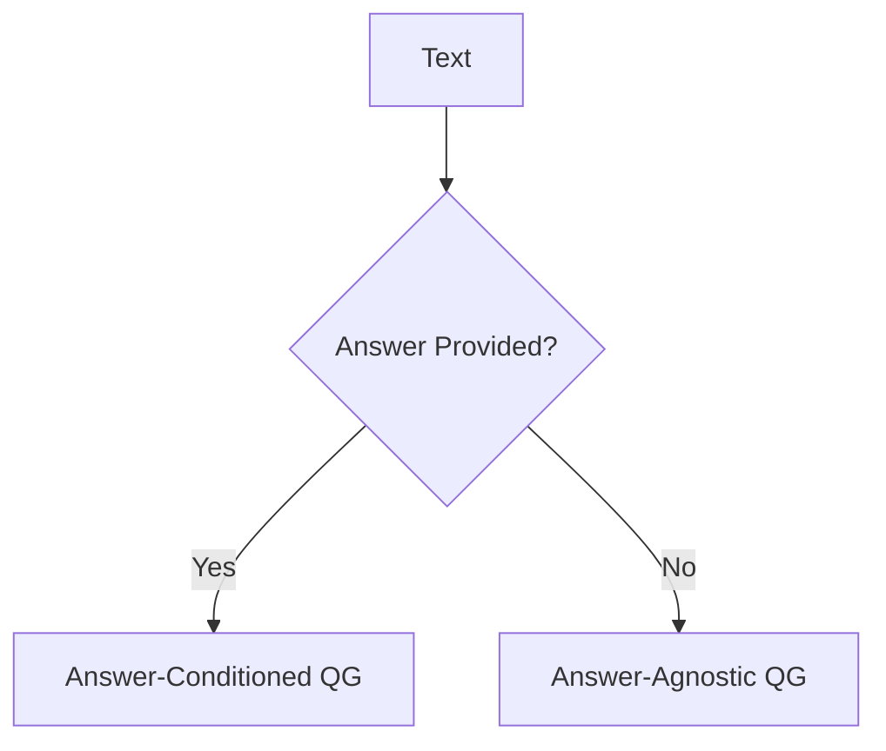

# Answer-Conditioned vs. Agnostic

Providing vs not providing target answer.

## Diagram

```mermaid
flowchart TD
  A[Text] --> B{Answer Provided?}
  B -->|Yes| C[Answer-Conditioned QG]
  B -->|No| D[Answer-Agnostic QG]
```

[Back to README](../README.md)
