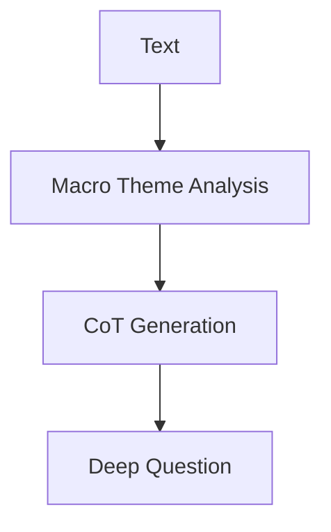

# Deep Cognitive QG

High-order logic and reasoning.

## Diagram

```mermaid
flowchart TD
  A[Text] --> B[Macro Theme Analysis]
  B --> C[CoT Generation]
  C --> D[Deep Question]
```

[Back to README](../README.md)
