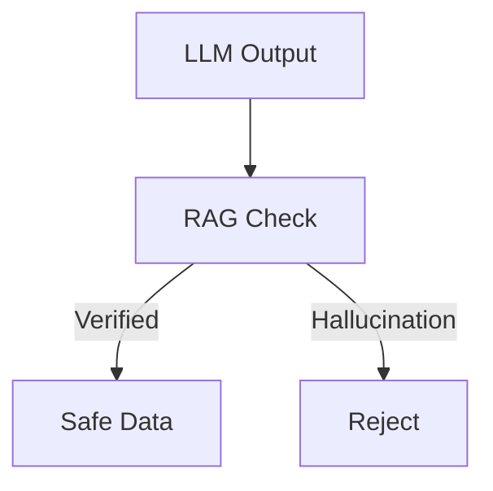

# The Hallucination Cascade

Model collapse due to synthetic errors.

## Diagram

```mermaid
flowchart TD
  A[LLM Output] --> B[RAG Check]
  B -->|Verified| C[Safe Data]
  B -->|Hallucination| D[Reject]
```

[Back to README](../README.md)
