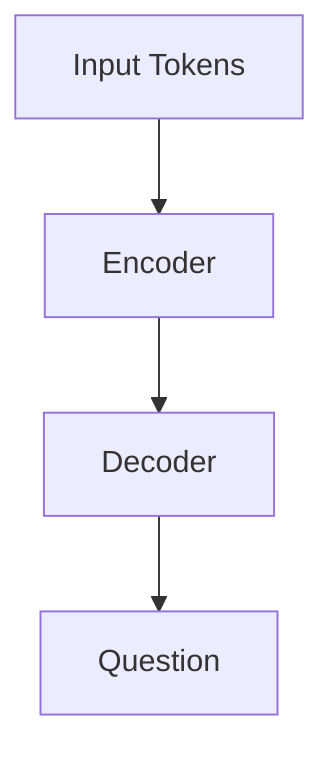

# The Neural Sequence-to-Sequence Era

Encoder-Decoder architectures.

## Diagram

```mermaid
flowchart TD
  A[Input Tokens] --> B[Encoder]
  B --> C[Decoder]
  C --> D[Question]
```

[Back to README](../README.md)
