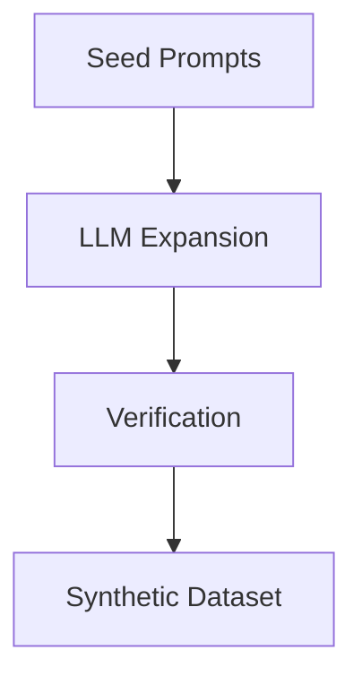

# Web-Scale Synthetic Datasets

Self-instruct LLM training.

## Diagram

```mermaid
flowchart TD
  A[Seed Prompts] --> B[LLM Expansion]
  B --> C[Verification]
  C --> D[Synthetic Dataset]
```

[Back to README](../README.md)
