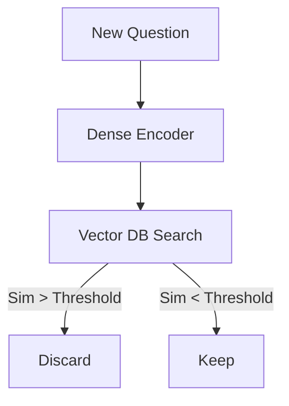

# Vector Database Deduplication Blocks

Semantic similarity search to prune duplicates.

## Diagram

```mermaid
flowchart TD
  A[New Question] --> B[Dense Encoder]
  B --> C[Vector DB Search]
  C -->|Sim > Threshold| D[Discard]
  C -->|Sim < Threshold| E[Keep]
```

[Back to README](../README.md)
