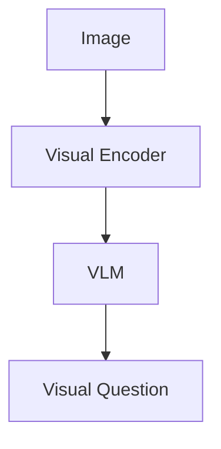

# Visual Question Generation (VQG)

Cross-modal image to question.

## Diagram

```mermaid
flowchart TD
  A[Image] --> B[Visual Encoder]
  B --> C[VLM]
  C --> D[Visual Question]
```

[Back to README](../README.md)
